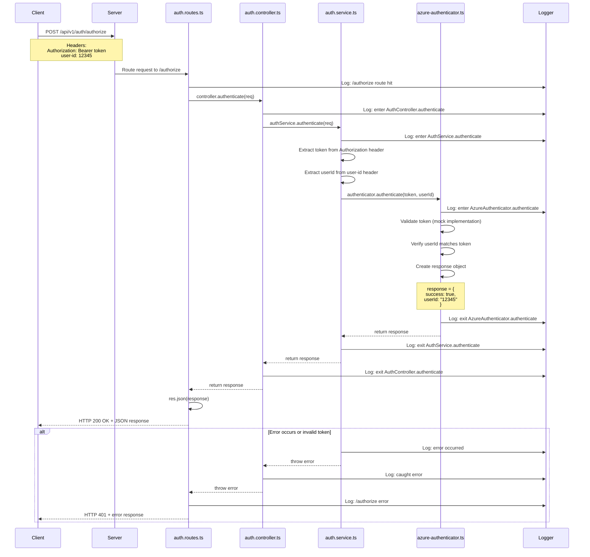

# Authorize Endpoint - Full Workflow

## Endpoint Details
- **URL**: `POST /api/v1/auth/authorize`
- **Purpose**: Verify user's authentication token and validate access
- **Authentication Required**: Yes (Bearer token)

## Request Format

### Headers
```
Authorization: Bearer <token>
user-id: string (optional)
```

### Body
No body required

## Response Format

### Success Response (200 OK)
```json
{
  "success": true,
  "userId": "string"
}
```

### Error Response (401 Unauthorized)
```json
{
  "success": false,
  "error": "Authorization failed"
}
```

## Workflow Diagram



## Data Flow

### 1. Client Request
```
POST /api/v1/auth/authorize
Authorization: Bearer mock-jwt-token
user-id: 12345
```

### 2. Server Middleware Chain
1. **CORS Middleware**: Validates origin
2. **JSON Parser**: Parses request body (empty)
3. **Logging Middleware**: Logs incoming request
4. **Route Handler**: Matches `/api/v1/auth/authorize`

### 3. Route Layer (`auth.routes.ts`)
- Receives request
- Logs route hit
- Calls `controller.authenticate(req)`
- Wraps in try-catch for error handling
- Returns 401 on error (not 500)

### 4. Controller Layer (`auth.controller.ts`)
- Logs entry point with masked token
- Calls `authService.authenticate(req)`
- Handles any errors from service
- Returns response to route

### 5. Service Layer (`auth.service.ts`)
- Extracts token from `req.headers['authorization']`
- Removes 'Bearer ' prefix from token
- Extracts userId from `req.headers['user-id']`
- Defaults to 'unknown' if not provided
- Calls `authenticator.authenticate(token, userId)`
- Handles errors from authenticator
- Returns authorization result

### 6. Authenticator Layer (`azure-authenticator.ts`)
- **Current**: Mock implementation returns success
- **Production**: Would:
  - Validate JWT token signature
  - Check token expiration
  - Verify userId matches token claims
  - Check token revocation status
- Returns `IAuthResponse` object

### 7. Response Path
- Authenticator → Service → Controller → Router → Client
- Each layer logs exit point
- Final response sent as JSON

## Use Cases

### Use Case 1: Valid Token Authorization
**Actor**: Authenticated User
**Preconditions**: User has valid, non-expired token
**Flow**:
1. User attempts to access protected resource
2. App sends authorize request with Bearer token
3. Server extracts and validates token
4. Server verifies token signature and expiration
5. Server confirms userId matches token
6. Server returns success response
7. App proceeds with protected action

**Postconditions**: User access is authorized

### Use Case 2: Expired Token
**Actor**: User with expired token
**Preconditions**: User's token has expired
**Flow**:
1. User attempts to access protected resource
2. App sends authorize request with expired token
3. Server validates token and detects expiration
4. Server returns 401 error
5. App redirects to login screen
6. User must re-authenticate

**Postconditions**: User must login again

### Use Case 3: Invalid/Tampered Token
**Actor**: Malicious user
**Preconditions**: User has invalid or tampered token
**Flow**:
1. User sends request with invalid token
2. Server attempts to validate token
3. Signature validation fails
4. Server returns 401 error
5. Access is denied

**Postconditions**: Unauthorized access prevented

### Use Case 4: Token Without User ID
**Actor**: Authenticated User
**Preconditions**: Request sent without user-id header
**Flow**:
1. User sends authorize request with only Bearer token
2. Service extracts userId as 'unknown'
3. Authenticator validates token
4. Response still returns success (in current mock)

**Postconditions**: Authorization succeeds based on token alone

## Security Considerations

### Current Implementation (Development)
- Mock authorization (always returns success)
- No actual token validation
- No signature verification
- No expiration checking
- Accepts any token value

### Production Requirements

1. **Token Validation**:
   - Verify JWT signature using secret/public key
   - Check token expiration (exp claim)
   - Validate issuer (iss claim)
   - Verify audience (aud claim)
   - Check not-before time (nbf claim)

2. **Token Claims Verification**:
   ```json
   {
     "sub": "12345",        // Subject (userId)
     "iss": "https://auth.soleo.com",
     "aud": "soleo-api",
     "exp": 1234567890,     // Expiration timestamp
     "iat": 1234567800,     // Issued at
     "nbf": 1234567800,     // Not before
     "roles": ["patient"],  // User roles
     "permissions": []      // User permissions
   }
   ```

3. **Token Revocation**:
   - Check against revocation list/blacklist
   - Implement token versioning
   - Support forced logout

4. **Rate Limiting**:
   - Limit authorization checks per token
   - Prevent brute force attacks
   - Track failed authorization attempts

5. **Logging & Monitoring**:
   - Log all authorization attempts
   - Alert on repeated failures
   - Track token usage patterns
   - Detect anomalies

## Common Use Patterns

### Middleware Pattern (Recommended)
In production, this endpoint logic should be used as middleware:

```typescript
// auth.middleware.ts
export async function requireAuth(req: Request, res: Response, next: NextFunction) {
  const token = req.headers['authorization']?.replace('Bearer ', '');

  if (!token) {
    return res.status(401).json({ error: 'No token provided' });
  }

  try {
    const result = await authService.authenticate(req);
    if (result.success) {
      req.user = { userId: result.userId };
      next();
    } else {
      res.status(401).json({ error: 'Invalid token' });
    }
  } catch (error) {
    res.status(401).json({ error: 'Authorization failed' });
  }
}

// Usage in routes
router.get('/protected-resource', requireAuth, (req, res) => {
  // Access req.user.userId
});
```

### Direct Endpoint Pattern (Current)
Used for explicit authorization checks:

```typescript
// Frontend checks if user is still authorized
const checkAuth = async () => {
  const response = await authService.authorize();
  if (!response.success) {
    redirectToLogin();
  }
};
```

## Testing

### Manual Test - Valid Token
```bash
curl -X POST http://localhost:3000/api/v1/auth/authorize \
  -H "Authorization: Bearer mock-jwt-token" \
  -H "user-id: 12345"
```

### Expected Response
```json
{
  "success": true,
  "userId": "12345"
}
```

### Manual Test - Missing Token
```bash
curl -X POST http://localhost:3000/api/v1/auth/authorize \
  -H "user-id: 12345"
```

### Expected Response (Current Mock)
```json
{
  "success": true,
  "userId": "12345"
}
```

Note: Production should return 401 error

### Manual Test - Missing User ID
```bash
curl -X POST http://localhost:3000/api/v1/auth/authorize \
  -H "Authorization: Bearer mock-jwt-token"
```

### Expected Response
```json
{
  "success": true,
  "userId": "12345"
}
```

## Integration with Frontend

### Svelte App Flow
```typescript
// In auth-service.ts
async authorize(): Promise<AuthResponse> {
  const response = await fetch(`${API_BASE_URL}/authorize`, {
    method: 'POST',
    headers: {
      Authorization: `Bearer ${this.token || ''}`
    }
  });

  return await response.json();
}

// Usage in app
const isAuthorized = async () => {
  const result = await authService.authorize();
  return result.success;
};
```

## Code References

- **Route Definition**: `src/api/v1/routes/auth.routes.ts:48-58`
- **Controller Method**: `src/api/v1/controllers/auth.controller.ts:78-104`
- **Service Method**: `src/api/v1/services/auth.service.ts:97-132`
- **Authenticator Method**: `src/api/v1/services/azure-authenticator.ts:64-76`

## Future Enhancements

1. **Role-Based Access Control (RBAC)**:
   - Add role verification
   - Check specific permissions
   - Return role information in response

2. **Token Refresh**:
   - Implement refresh token logic
   - Auto-refresh expired tokens
   - Seamless token rotation

3. **Multi-Factor Authentication**:
   - Support MFA verification
   - Time-based OTP validation
   - Biometric authentication

4. **Session Management**:
   - Track active sessions
   - Support session timeout
   - Enable remote session termination

5. **Detailed Error Responses**:
   ```json
   {
     "success": false,
     "error": "Token expired",
     "errorCode": "TOKEN_EXPIRED",
     "expiresAt": "2024-01-01T00:00:00Z"
   }
   ```
