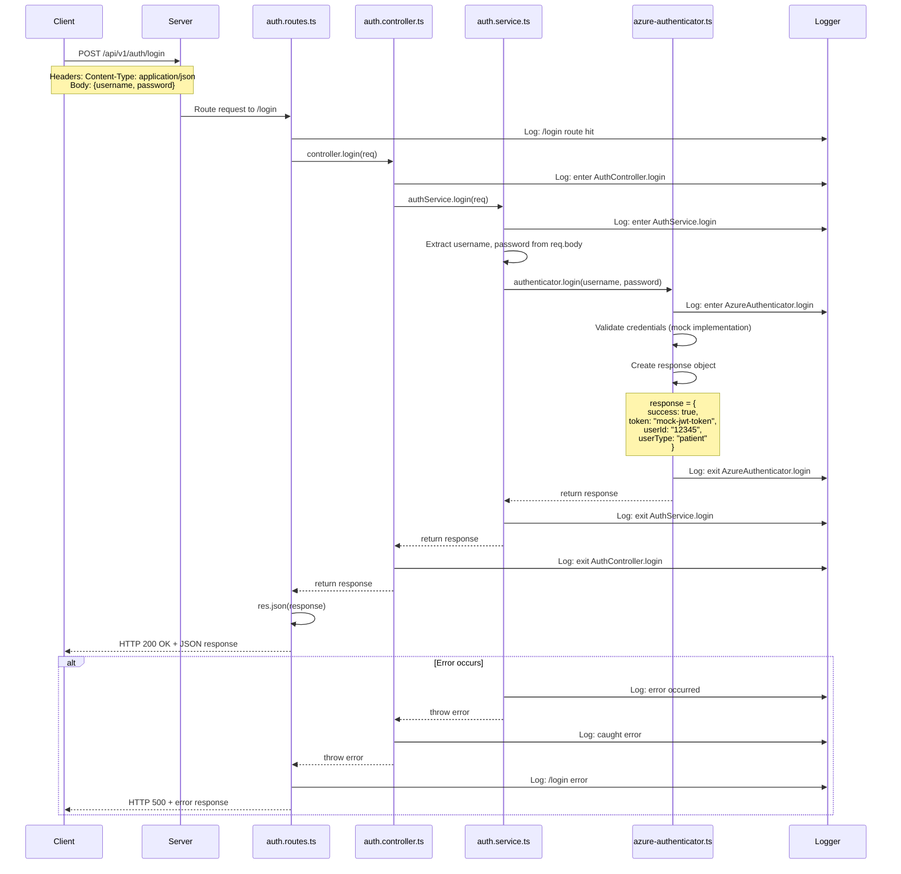

# Login Endpoint - Full Workflow

## Endpoint Details
- **URL**: `POST /api/v1/auth/login`
- **Purpose**: Authenticate user with username and password
- **Authentication Required**: No

## Request Format

### Headers
```
Content-Type: application/json
```

### Body
```json
{
  "username": "string",
  "password": "string"
}
```

## Response Format

### Success Response (200 OK)
```json
{
  "success": true,
  "token": "string",
  "userId": "string",
  "userType": "string"
}
```

### Error Response (500 Internal Server Error)
```json
{
  "success": false,
  "error": "Login failed"
}
```

## Workflow Diagram



## Data Flow

### 1. Client Request
```
POST /api/v1/auth/login
Content-Type: application/json

{
  "username": "patient123",
  "password": "securepass"
}
```

### 2. Server Middleware Chain
1. **CORS Middleware**: Validates origin
2. **JSON Parser**: Parses request body
3. **Logging Middleware**: Logs incoming request
4. **Route Handler**: Matches `/api/v1/auth/login`

### 3. Route Layer (`auth.routes.ts`)
- Receives request
- Logs route hit
- Calls `controller.login(req)`
- Wraps in try-catch for error handling

### 4. Controller Layer (`auth.controller.ts`)
- Logs entry point
- Calls `authService.login(req)`
- Handles any errors from service
- Returns response to route

### 5. Service Layer (`auth.service.ts`)
- Extracts `username` and `password` from `req.body`
- Performs security checks (placeholder)
- Calls `authenticator.login(username, password)`
- Handles errors from authenticator
- Returns authentication result

### 6. Authenticator Layer (`azure-authenticator.ts`)
- **Current**: Mock implementation returns hardcoded response
- **Production**: Would validate credentials against Azure AD
- Returns `ILoginResponse` object

### 7. Response Path
- Authenticator → Service → Controller → Router → Client
- Each layer logs exit point
- Final response sent as JSON

## Use Cases

### Use Case 1: Successful Login
**Actor**: Patient User
**Preconditions**: User has valid credentials
**Flow**:
1. User enters username and password in mobile app
2. App sends POST request to `/api/v1/auth/login`
3. Server validates credentials
4. Server generates authentication token
5. Server returns success response with token
6. App stores token for future requests

**Postconditions**: User is authenticated and receives token

### Use Case 2: Invalid Credentials
**Actor**: Patient User
**Preconditions**: User enters incorrect password
**Flow**:
1. User enters username and wrong password
2. App sends POST request to `/api/v1/auth/login`
3. Server attempts to validate credentials
4. Validation fails
5. Server returns error response

**Postconditions**: User remains unauthenticated

### Use Case 3: Server Error
**Actor**: Patient User
**Preconditions**: Server experiences an error
**Flow**:
1. User sends valid login request
2. Server encounters internal error
3. Error is caught and logged
4. Server returns 500 error response

**Postconditions**: User is informed of error, can retry

## Security Considerations

### Current Implementation (Development)
- Mock authentication (always returns success)
- Passwords logged (MUST BE REMOVED IN PRODUCTION)
- No rate limiting
- No input validation

### Production Requirements
1. **Password Handling**:
   - Never log passwords
   - Hash passwords before transmission (HTTPS)
   - Use bcrypt/argon2 for password hashing

2. **Rate Limiting**:
   - Limit login attempts per IP
   - Implement exponential backoff

3. **Input Validation**:
   - Sanitize username and password
   - Validate format and length
   - Prevent SQL injection

4. **Token Security**:
   - Use JWT with proper expiration
   - Implement refresh tokens
   - Store tokens securely

## Testing

### Manual Test
```bash
curl -X POST http://localhost:3000/api/v1/auth/login \
  -H "Content-Type: application/json" \
  -d '{"username":"testuser","password":"testpass"}'
```

### Expected Response
```json
{
  "success": true,
  "token": "mock-jwt-token",
  "userId": "12345",
  "userType": "patient"
}
```

## Code References

- **Route Definition**: `src/api/v1/routes/auth.routes.ts:18-28`
- **Controller Method**: `src/api/v1/controllers/auth.controller.ts:20-47`
- **Service Method**: `src/api/v1/services/auth.service.ts:31-59`
- **Authenticator Method**: `src/api/v1/services/azure-authenticator.ts:25-39`
