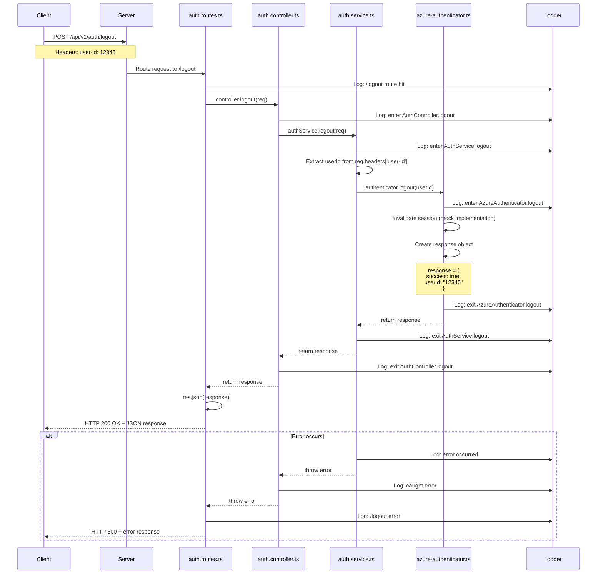

# Logout Endpoint - Full Workflow

## Endpoint Details
- **URL**: `POST /api/v1/auth/logout`
- **Purpose**: Terminate user session and invalidate authentication
- **Authentication Required**: Yes (user-id header)

## Request Format

### Headers
```
user-id: string
```

### Body
No body required

## Response Format

### Success Response (200 OK)
```json
{
  "success": true,
  "userId": "string"
}
```

### Error Response (500 Internal Server Error)
```json
{
  "success": false,
  "error": "Logout failed"
}
```

## Workflow Diagram



## Data Flow

### 1. Client Request
```
POST /api/v1/auth/logout
user-id: 12345
```

### 2. Server Middleware Chain
1. **CORS Middleware**: Validates origin
2. **JSON Parser**: Parses request body (empty)
3. **Logging Middleware**: Logs incoming request
4. **Route Handler**: Matches `/api/v1/auth/logout`

### 3. Route Layer (`auth.routes.ts`)
- Receives request
- Logs route hit
- Calls `controller.logout(req)`
- Wraps in try-catch for error handling

### 4. Controller Layer (`auth.controller.ts`)
- Logs entry point
- Calls `authService.logout(req)`
- Handles any errors from service
- Returns response to route

### 5. Service Layer (`auth.service.ts`)
- Extracts `userId` from `req.headers['user-id']`
- Defaults to 'unknown' if not provided
- Calls `authenticator.logout(userId)`
- Handles errors from authenticator
- Returns logout result

### 6. Authenticator Layer (`azure-authenticator.ts`)
- **Current**: Mock implementation returns success
- **Production**: Would invalidate session/token in Azure AD
- Returns `ILogoutResponse` object

### 7. Response Path
- Authenticator → Service → Controller → Router → Client
- Each layer logs exit point
- Final response sent as JSON

## Use Cases

### Use Case 1: Successful Logout
**Actor**: Authenticated User (Patient/Employee)
**Preconditions**: User is logged in with valid session
**Flow**:
1. User clicks logout in mobile app
2. App sends POST request to `/api/v1/auth/logout` with user-id header
3. Server receives request with userId
4. Server invalidates user session/token
5. Server returns success response
6. App clears stored authentication data
7. App redirects to login screen

**Postconditions**: User session is terminated

### Use Case 2: Logout Without User ID
**Actor**: User
**Preconditions**: Request sent without user-id header
**Flow**:
1. Request sent without proper headers
2. Service extracts userId (gets 'unknown')
3. Authenticator processes logout for 'unknown'
4. Response still returns success (graceful handling)

**Postconditions**: Generic logout processed

### Use Case 3: Server Error During Logout
**Actor**: Authenticated User
**Preconditions**: Server experiences error
**Flow**:
1. User requests logout
2. Server encounters internal error
3. Error is caught and logged
4. Server returns 500 error response
5. App may retry or clear local data anyway

**Postconditions**: User informed of error

## Security Considerations

### Current Implementation (Development)
- Mock logout (always returns success)
- No actual session invalidation
- Accepts any userId
- No validation of user-id header

### Production Requirements
1. **Session Invalidation**:
   - Revoke JWT tokens
   - Clear server-side sessions
   - Invalidate refresh tokens
   - Update token blacklist

2. **Header Validation**:
   - Validate user-id format
   - Verify user-id matches authenticated user
   - Prevent logout of other users

3. **Audit Logging**:
   - Log all logout events
   - Include timestamp and user information
   - Track logout location/device

4. **Token Cleanup**:
   - Remove from token store
   - Clear cached user data
   - Notify other sessions (if multi-device)

## Testing

### Manual Test
```bash
curl -X POST http://localhost:3000/api/v1/auth/logout \
  -H "user-id: 12345"
```

### Expected Response
```json
{
  "success": true,
  "userId": "12345"
}
```

### Test Without User ID
```bash
curl -X POST http://localhost:3000/api/v1/auth/logout
```

### Expected Response
```json
{
  "success": true,
  "userId": "12345"
}
```
Note: Currently returns hardcoded userId even without header

## Integration with Frontend

### Svelte App Flow
```typescript
// In auth-service.ts
async logout(): Promise<AuthResponse> {
  const response = await fetch(`${API_BASE_URL}/logout`, {
    method: 'POST',
    headers: {
      'user-id': this.userId || ''
    }
  });

  const data = await response.json();

  if (data.success) {
    this.token = null;
    this.userId = null;
  }

  return data;
}
```

## Code References

- **Route Definition**: `src/api/v1/routes/auth.routes.ts:33-43`
- **Controller Method**: `src/api/v1/controllers/auth.controller.ts:52-73`
- **Service Method**: `src/api/v1/services/auth.service.ts:66-91`
- **Authenticator Method**: `src/api/v1/services/azure-authenticator.ts:46-56`

## Improvements Needed for Production

1. **Authentication Middleware**: Add middleware to verify user-id belongs to authenticated session
2. **Token Revocation**: Implement actual token invalidation
3. **Multi-Device Logout**: Option to logout from all devices
4. **Activity Logging**: Detailed audit trail
5. **Error Handling**: More specific error codes and messages
